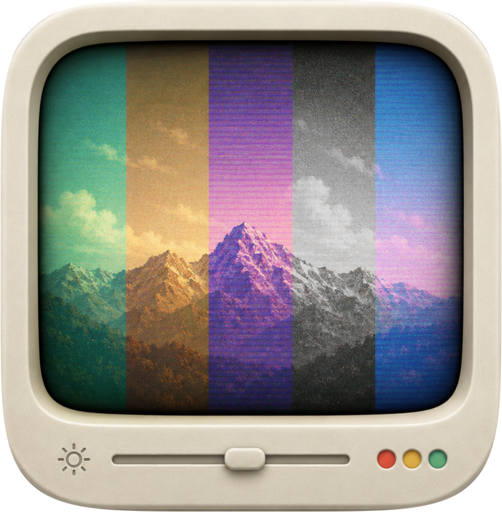
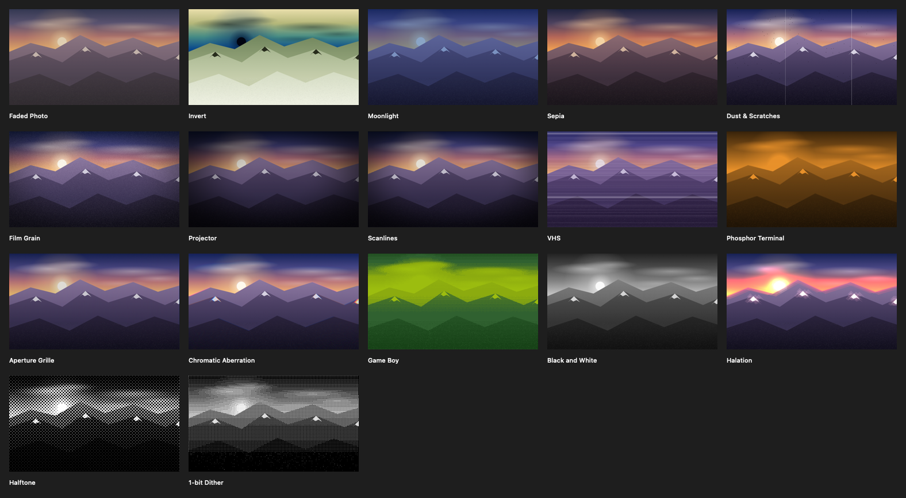
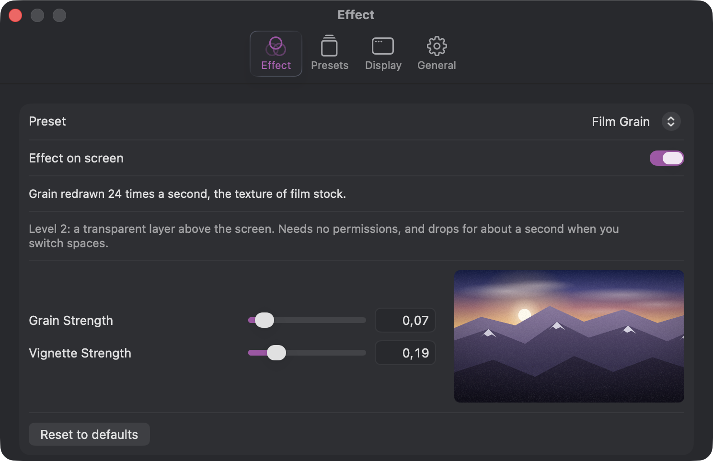

<p align="center"></p>

<h1 align="center">Subvenio Screen</h1>

<p align="center">one hotkey between your Mac and 1984</p>

<p align="center">
  <a href="https://github.com/boundlessend/subvenio-screen/actions/workflows/build.yml"></a>
  <a href="../../releases/latest"></a>
  <a href="../../releases"></a>
  
  
  
</p>

Subvenio Screen lives in the menu bar and lays a film-grain, scanline, VHS or
sepia look over your whole desktop - every app, the Dock, the menu bar. One
hotkey turns it on, the same hotkey turns it off, and the effect is back exactly
where you left it after a restart.

<p align="center"></p>

The seventeen presets that ship with the app, in the order the menu groups them,
each rendered through the same shader the screen gets. The effect itself cannot be screenshotted: the overlay is excluded
from screen capture on purpose, so these are offline renders of the picture the
settings window previews on.

## Features

- **Seventeen presets out of the box**, grouped in the menu by what they cost:
  free ones that rewrite the display table, ones that draw a layer over the
  screen, and ones that read the screen back.
- **One global hotkey** for the whole screen, recorded in settings. No
  Accessibility permission needed.
- **Live tuning.** Every preset has its own sliders - grain strength, vignette,
  scanline depth - and moving them changes the running effect immediately.
- **A preview next to the sliders**, so you can see what a preset does before
  putting it on the whole screen. It runs on a picture that ships with the app,
  so even the preset that reads the screen previews without asking for anything.
- **Window-only mode.** Instead of the whole display, the effect can follow a
  single window as it moves and resizes.
- **Pick your display** when more than one is connected.
- **Light on the machine.** Capture size and frame rate caps are yours to set;
  the effect pauses when the screen sleeps and steps down in Low Power Mode.
- **Stays out of the way.** No Dock icon, no windows unless you open settings,
  and problems are reported quietly through the menu bar icon instead of a modal
  dialog. Animated presets respect the system "Reduce Motion" setting.
- **Your own effects.** Presets are folders with a Metal shader, not a fixed
  list. Drop one in and it shows up in the menu without restarting the app, and
  editing the one that is running changes the screen as you save.
- **Update check** against the GitHub releases page - weekly by default, or
  daily, monthly or never, and there is a Check now button. The app never
  downloads or installs anything by itself; it tells you a version is out and
  opens the release page.
- **English and Russian interface.** Launch at login is one checkbox.

<p align="center"></p>

## Install

1. Download the `.dmg` from the [Releases](../../releases/latest) page.
2. Open it and drag **Subvenio Screen** into your **Applications** folder.
3. The build is signed but **not notarized**, so Gatekeeper blocks it on the
   first launch. Open it once this way: **right click** (or Control-click) the
   app in Applications and choose **Open**, then confirm in the dialog. If macOS
   still refuses, go to **System Settings → Privacy & Security**, scroll down
   and click **Open Anyway**.

After the first launch macOS remembers the choice and opens the app normally.

If the app is reported as "damaged", the quarantine flag is the cause. Clear it
once in Terminal:

```sh
xattr -dr com.apple.quarantine "/Applications/Subvenio Screen.app"
```

The app checks the Releases page for a newer version - once a week unless you
change it in settings - and tells you in its menu when one is out. Installing is
still a manual step: a new version means a new disk image from Releases.

## The presets

| Preset | What it does | Cost |
|--------|--------------|------|
| Invert | inverts the picture, cursor and menu bar included | free |
| Sepia | warm tint with lifted blacks | free |
| Faded Photo | washed-out warm tint, a photo left in the sun | free |
| Moonlight | blue and dimmed, the day-for-night trick from film | free |
| Scanlines | CRT lines over the screen | one drawn layer |
| Film Grain | flickering grain with a vignette | one drawn layer |
| VHS | purple tint, line noise and a drifting band | one drawn layer |
| Dust & Scratches | film wear: scratches and specks, each one frame long | one drawn layer |
| Projector | the lamp breathing, the corners in shadow | one drawn layer |
| Black and White | true desaturation, not a tint | reads the screen |
| Phosphor Terminal | luminance poured into one phosphor, amber or green | reads the screen |
| Aperture Grille | every third column to its own phosphor | reads the screen |
| Halation | light spreading past the edge of what emits it | reads the screen |
| Chromatic Aberration | channels diverging towards the edges | reads the screen |
| Halftone | newspaper printing, the grid turned 45 degrees | reads the screen |
| 1-bit Dither | black and white with a Bayer pattern between them | reads the screen |
| Game Boy | the four DMG shades and dithering between them | reads the screen |

The eight presets that read the screen ask for the Screen Recording permission -
and only the first time you turn one on by hand. The other nine work without any
permission at all, and refusing leaves them fully usable.

The last three are worth a warning: quantising the screen to two shades or four
makes small text hard to read. They are effects to look at rather than to work
under.

Captured frames live in memory just long enough to be drawn. Nothing is written
to disk and nothing leaves the machine.

## Your own effects

A preset is a folder with a `manifest.json` and a Metal fragment function.
**New preset from template** in settings writes a working one for you and shows
it in Finder; **Open shaders folder** takes you to the rest. Save a file and the
menu updates itself, no restart - and if you edit the preset that is currently
on screen, the screen follows. A broken preset shows the actual error instead of
quietly disappearing: a manifest that does not parse is named in the menu, and a
shader that does not compile shows the compiler's message under the preview.

A preset can name its own menu bar icon and describe itself in a line that
shows up under the preview and as a tooltip in the menu, in English or in
Russian.

The bundled presets are yours to edit, and yours to delete. An edited one stays
as you left it even when a new version of the app ships a different version of
the same preset, a deleted one stays deleted, and **Restore bundled presets** in
settings puts them all back the way they came.

The format is described in [DEVELOPMENT.md](DEVELOPMENT.md#writing-a-shader).

**A preset someone hands you is code, not a picture.** It is Metal source that
this app compiles and runs on your GPU. The app runs inside the App Sandbox, so a
preset cannot reach your files or the network, but it can still draw whatever it
likes over your whole screen and cost as much GPU time as it wants. Read a shader
before you drop it in, the same way you would read a script.

## Known limits

- One effect on one display at a time. You choose which display, but independent
  presets on several monitors at once are not implemented yet.
- Invert and Sepia cover the whole display by nature and cannot be confined to a
  single window.
- The overlay is invisible to screenshots and to screen recording, so the effect
  will not show up in a capture of your own screen.
- Apple Silicon only.

## Under the hood

Built from source with `make run`; the details live in
[DEVELOPMENT.md](DEVELOPMENT.md), and the reasoning behind the architecture in
[PLAN.md](PLAN.md). What changed between versions is in
[CHANGELOG.md](CHANGELOG.md).

## License

[BSD 3-Clause](LICENSE). The two dependencies,
[KeyboardShortcuts](https://github.com/sindresorhus/KeyboardShortcuts) and
[Pow](https://github.com/EmergeTools/Pow), are MIT.
